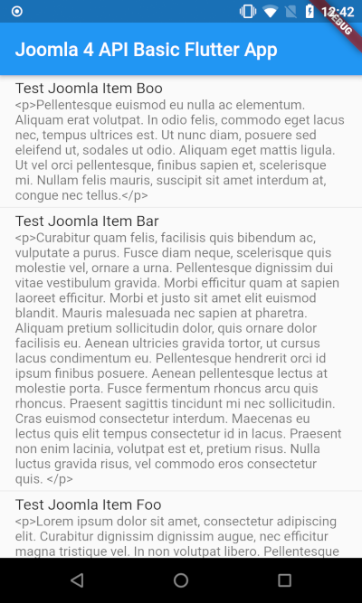

# Joomla 4 API Basic Flutter App

A basic flutter app using the Joomla 4 API.


## Getting Started

Set up flutter, see https://flutter.dev/docs/get-started/install

Get this code from https://github.com/AndyGaskell/joomla4api_basic_flutter_app

Set the details for your Joomla 4 site in the file...

```lib/Networking/rest_api_manager.dart```

This needs...
* Site URL
* Joomla site's username
* Joomla site's password


Create all the various other flutter files...

```flutter create .```

Build and run the app...

```flutter run```


## What the App does

It is just using the content API endpoint, pulling all articles and displaying them in a list.

This is what it looks like on an Android Nexus 4 running Android 8.1.0...




## Troubleshooting

Flutter set-up issues can usually solved by running...

```flutter doctor```

To check the API is working you can test it with a cURL call, like...

```curl --location --request GET 'https://your_site_base_url.com/api/index.php/v1/content/article' --header 'Authorization: Basic basicAuth'```

...in the above curl call, you can get the ```basicAuth``` value from the flutter terminal output.


## Things to do next 

I could / should do some more bits to this, like...

- [ ] add HTML rendering
- [ ] add error handling
- [ ] some other stuff...


## General Flutter links

* https://flutter.dev/docs/get-started/codelab
* https://flutter.dev/docs
* https://flutter.dev/docs/cookbook


## Joomla API Refs

* https://www.joomdev.com/blog/entry/joomla-4-api-introduction
* https://docs.joomla.org/J4.x:Joomla_Core_APIs


## Useful Flutter Refs

* https://medium.com/@hagenverfolgt/basic-http-auth-with-flutter-the-right-way-e5209cbe4b55
* https://medium.com/@yugandhar0189/flutter-json-parsing-from-network-response-9c0e8756d43
* https://github.com/yugandh/Flutter_JsonParsing
* https://app.quicktype.io/
